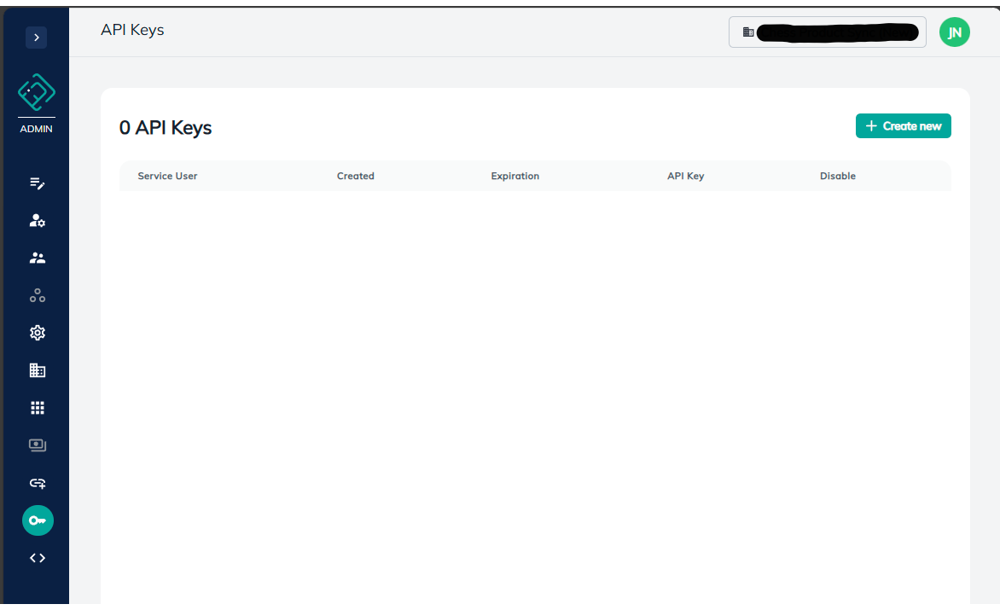
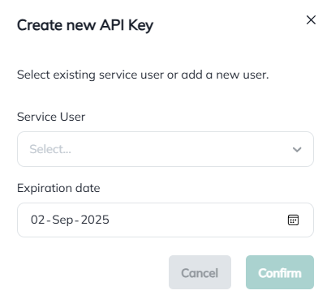
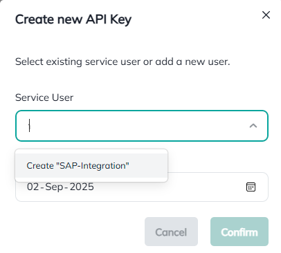
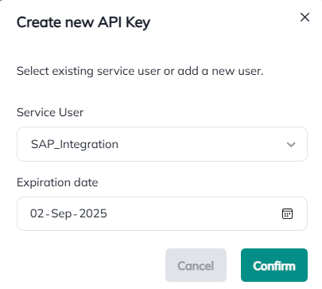
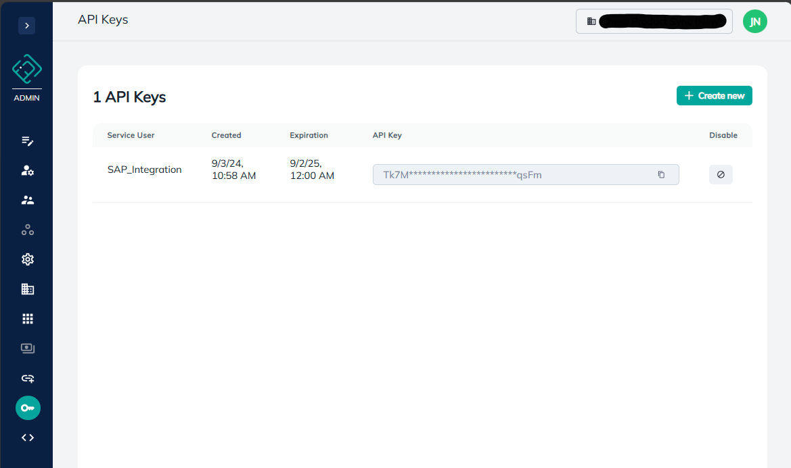

## API Key
Through our admin interface you can create API keys to call our API with.

To start with you need to go to our [admin interface](https://app.dmaze.com/admin/api-keys). You should see something like this then:



Click on create



If you do not have a Service User you have to create one, type the name and click 'Create "Name of service user"'.



Then make sure the [Service User](service_user.md) you created is selected, select expiration date (recommend to create new API key on a regular basis, in accordance with best practices). Finally click 'Confirm' to create the API key.



You will then be presented with a screen that looks like this:



Here you can copy the API key, use it to call our API, you can see the expiration date on your keys and you can disable a key. A disabled key will no longer be able to call our API.

When calling our API with an API key you need to set a new header with the api key as value:
```
x-apikey: apikey-value
```

You do not need to register the app with Microsoft Entra or aquire a token to use the API key.