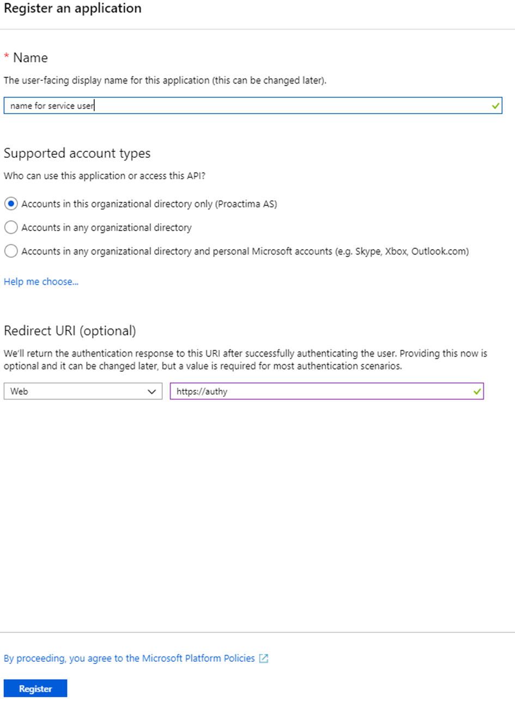
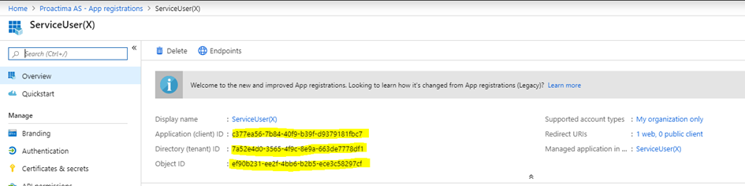
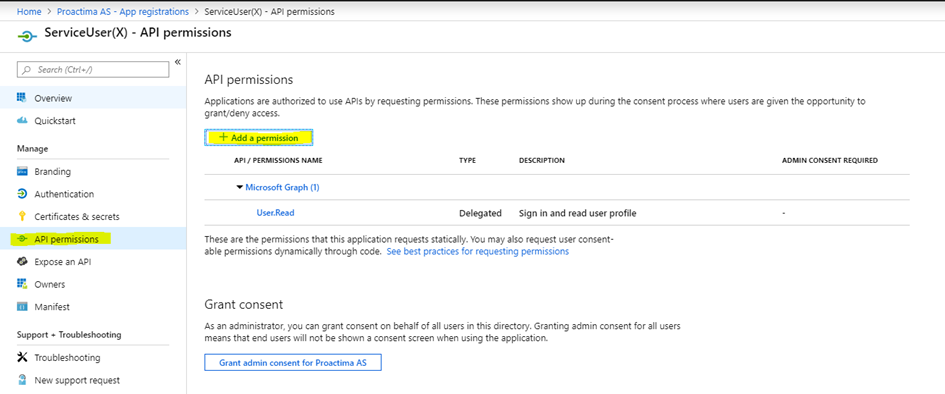
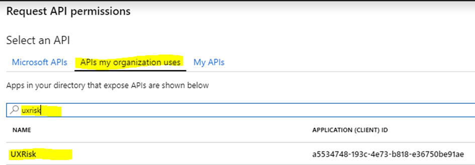
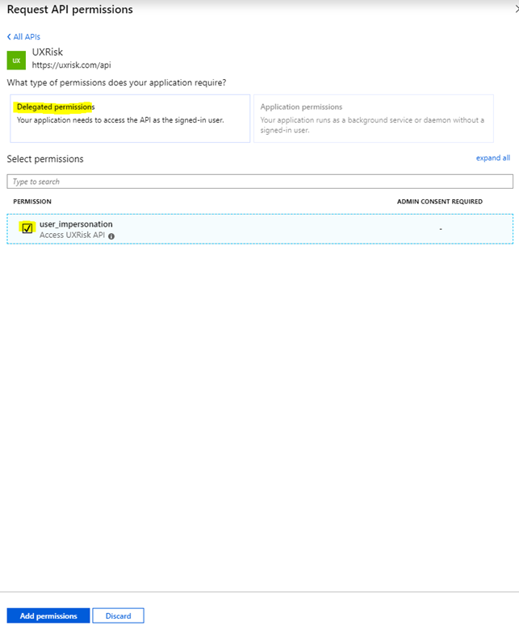
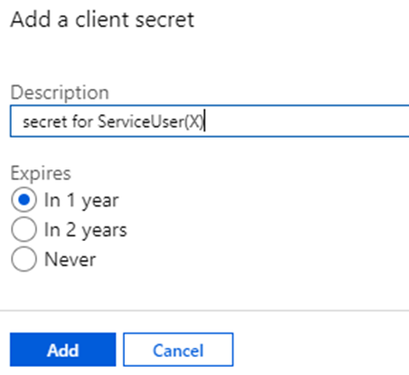
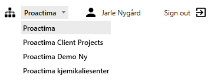
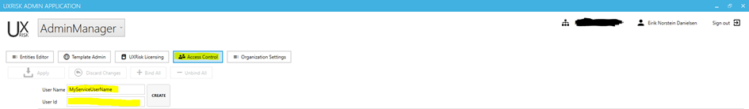

# Create a Service User for UXRisk integration <!-- omit in toc -->

- [App Registration](#app-registration)
- [API permissions](#api-permissions)
- [UXRisk Admin App](#uxrisk-admin-app)

## App Registration

Log into portal.azure.com as a Global administrator.

Select 1. Azure Active Directory in the left menu – 2. App registrations in the next menu and 3. New registration to the right.

On the next screen
Give the application a name representing the service user and add https://authy as Redirect URI.
Click Register

On the next screen

The highlighted ids will be used for your integration to UXRisk

## API permissions

Click Add a permission

Select APIs my organization uses, search for uxrisk and select it

Make sure Delegated permissions is selected and tick user_impersonation.

Click Add permissions

Add a new secret for this user – click New client secret

Give it a description and choose when it should expire

Make sure that you copy and save the secret value.
This completes the setup of the service user in Azure AD.

## UXRisk Admin App

Make sure to select the correct organisation – main or sandbox – by selecting from the dropdown

Click Access Control

Give the service user a name and enter (paste) the Object ID from a previous step.

Click create. Now you have a service user in the correct organisation to run integrations.
